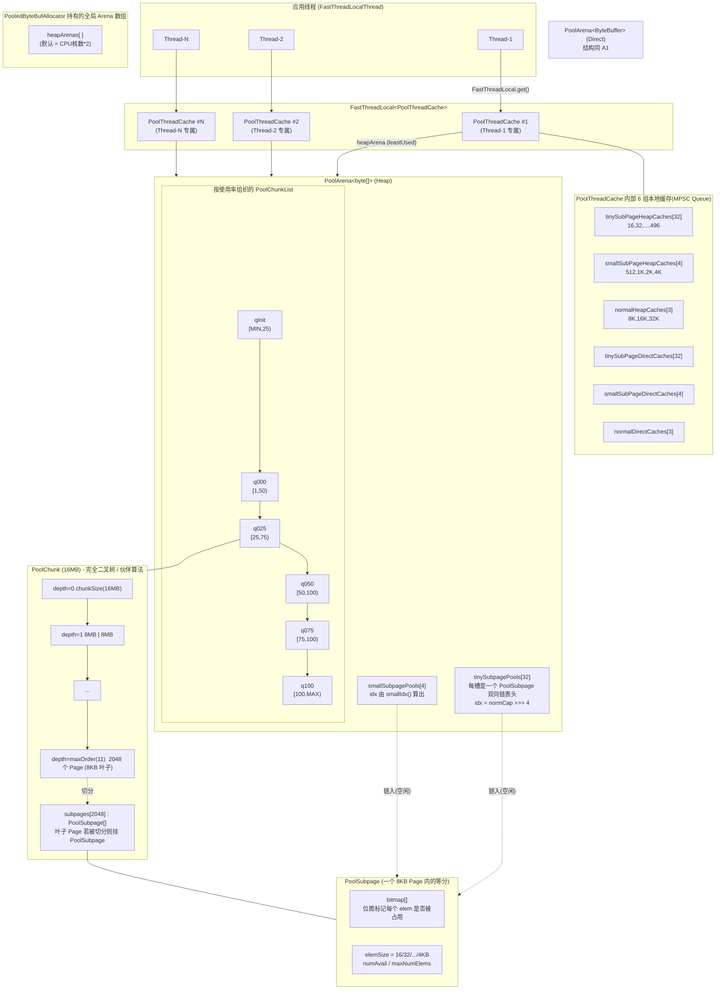
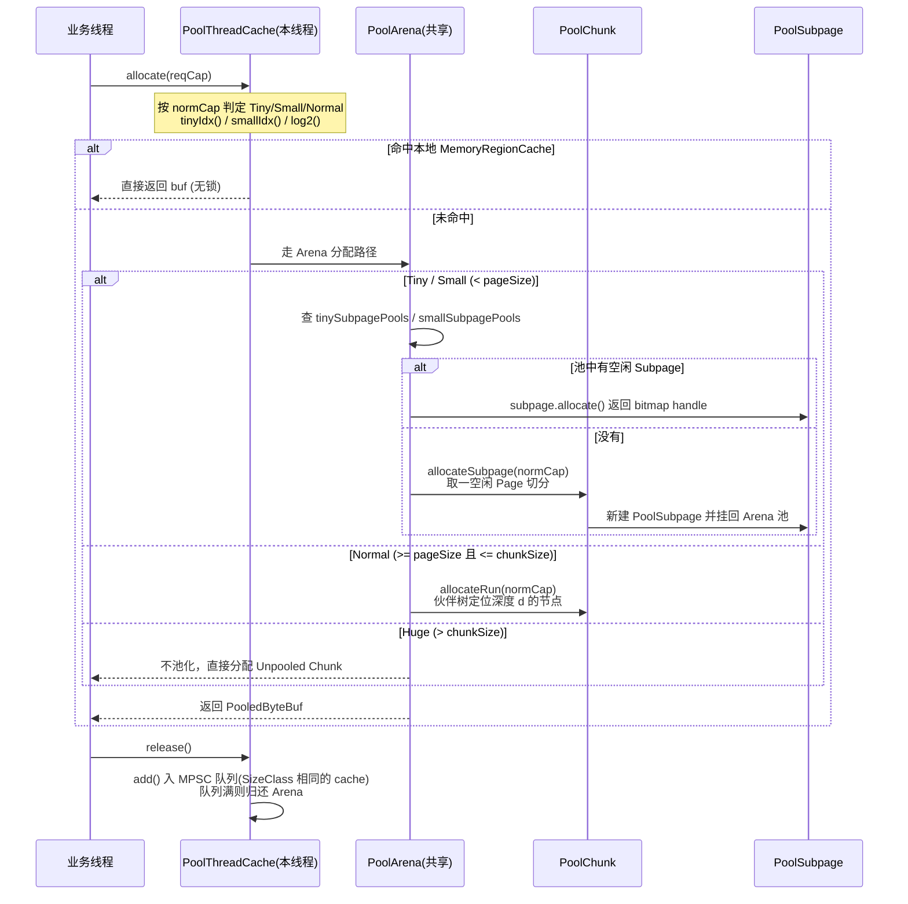
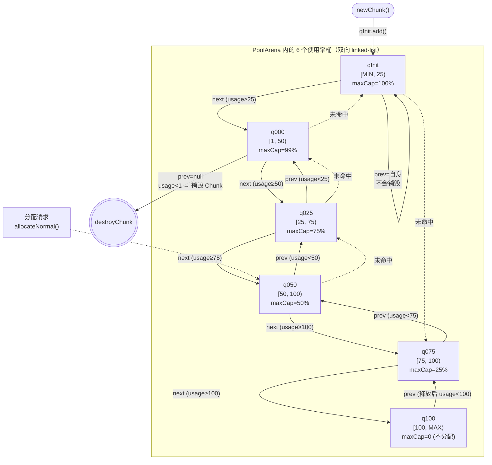
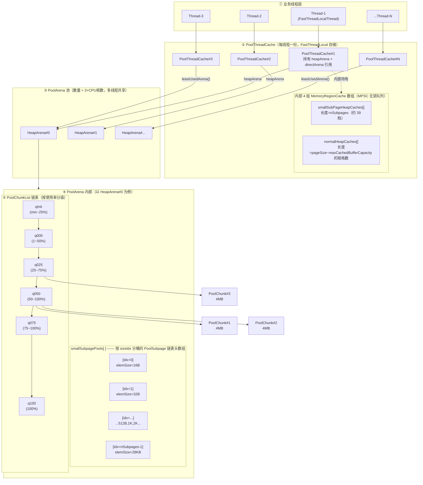
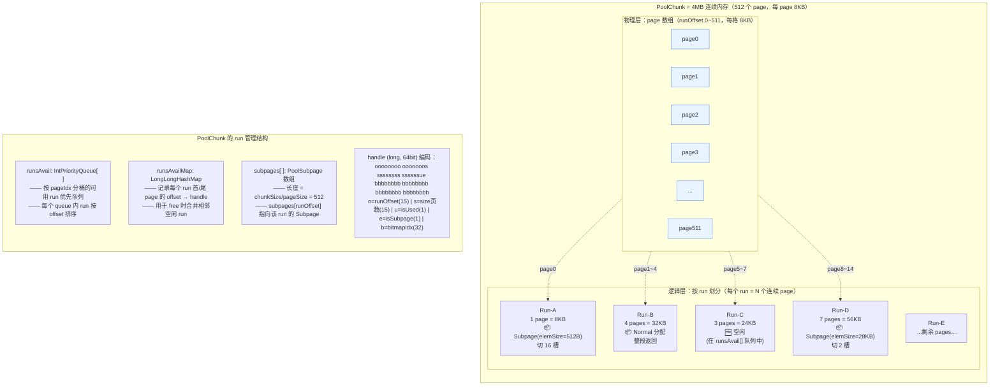
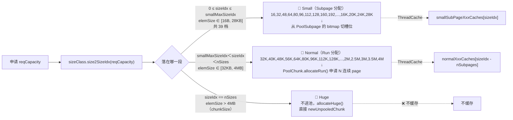

## 一、核心概念与内存划分

Netty 的内存池（基于 jemalloc 思想）从大到小按以下层级组织：

| 层级 | 大小 | 说明 |
|---|---|---|
| **Chunk** | 16 MB（`chunkSize = pageSize × 2^maxOrder`，默认 8KB×2^11） | 一次向 OS 申请的大块，由完全二叉树（伙伴算法）管理 |
| **Page** | 8 KB（`pageSize`，默认 8192） | Chunk 的叶子节点，是页级分配的最小单元 |
| **Subpage** | < 8 KB | 把一个 Page 切成更小的等长块 |

按申请的**规格化容量** `normCapacity` 划分为三类：

| SizeClass | 范围 | 分配方式 | 池数组大小 |
|---|---|---|---|
| **Tiny** | `[16B, 512B)`，按 16B 步进 | 在 Page 内切 Subpage | `numTinySubpagePools = 512>>>4 = 32` |
| **Small** | `[512B, pageSize)`，按 2 的幂 | 在 Page 内切 Subpage | `numSmallSubpagePools = pageShifts - 9`（默认 4：512/1K/2K/4K）|
| **Normal** | `[pageSize, chunkSize]`，按 2 的幂 | 在 Chunk 上分配整页或多页（伙伴树）| `log2(max/pageSize)+1` |
| Huge | `> chunkSize` | 不池化，直接分配 | — |

规整的原因：PoolChunk 的伙伴树(完全二叉树)要求每层节点大小 = chunkSize / 2^depth(2 的幂)以及Subpage 的 bitmap 管理要求pageSize / elemSize 必须是整数

**规整后会造成最大≈50%的内存内部碎片(按 2 的幂)**

Netty的取舍：牺牲少量内存利用率，换取极简的伙伴树和 O(logN) 的分配/释放

业务侧针对Netty的优化策略:
- 复用内存避免频繁申请释放
- 按2 的幂申请内存
- 调整chunkSize和pageSize，比如业务使用的内存在1~4kb，则pageSize调整为4kb；比如业务偶发申请几mb的内存，则chunkSize调小走unpooled
- 小对象尽量优化到 512B 以下

---

## 二、`PoolThreadCache` 与线程的关系

线程绑定通过 [PooledByteBufAllocator.java](/Users/liyang/Downloads/netty-buffer-4.1.33.Final/io/netty/buffer/PooledByteBufAllocator.java) 中的 `PoolThreadLocalCache extends FastThreadLocal<PoolThreadCache>` 实现：

- 每个线程**首次申请**内存时，`initialValue()` 被触发：
    1. 在 `heapArenas[]` 与 `directArenas[]` 中通过 `leastUsedArena()` 各挑选一个**线程绑定数最少**的 Arena（`numThreadCaches` 最小者）。
    2. 用挑中的 Arena 构造该线程独占的 `PoolThreadCache`。
- 线程退出时 `onRemoval()` → `PoolThreadCache.free()` 释放本地缓存。
- 因此：**一个线程 ↔ 一个 PoolThreadCache ↔ 1 个 heapArena + 1 个 directArena**（Arena ↔ 线程是多对一的关系）。

`PoolThreadCache` 内部为它绑定的 Arena 维护 6 组 `MemoryRegionCache[]`（MPSC 队列缓存已释放但未归还的内存）

释放路径：`free` 时优先放回当前线程的 `MemoryRegionCache`（无锁，MPSC 队列），下次同线程同规格分配可直接命中，避开 Arena 全局锁。

---

## 三、整体结构示意图（Mermaid）

---

## 四、分配流程示意（命中缓存优先）

---

## 五、关键数据结构对应到代码的关系一览

| 对象 | 文件 | 作用 |
|---|---|---|
| `PoolThreadCache` | [PoolThreadCache.java](/Users/liyang/Downloads/netty-buffer-4.1.33.Final/io/netty/buffer/PoolThreadCache.java) | 线程私有缓存；持有 `heapArena` + `directArena` 引用 + 6 组 `MemoryRegionCache[]` |
| `PoolThreadLocalCache` | [PooledByteBufAllocator.java](/Users/liyang/Downloads/netty-buffer-4.1.33.Final/io/netty/buffer/PooledByteBufAllocator.java) | `FastThreadLocal<PoolThreadCache>`，把 cache 绑定到线程 |
| `PoolArena` | [PoolArena.java](/Users/liyang/Downloads/netty-buffer-4.1.33.Final/io/netty/buffer/PoolArena.java) | 全局共享内存竞技场；含 `tinySubpagePools[32]`、`smallSubpagePools[N]`、6 个 `PoolChunkList` |
| `PoolChunk` | [PoolChunk.java](/Users/liyang/Downloads/netty-buffer-4.1.33.Final/io/netty/buffer/PoolChunk.java) | 一块 16MB；用 `memoryMap`/`depthMap` 表示完全二叉树，伙伴算法 |
| `PoolSubpage` | [PoolSubpage.java](/Users/liyang/Downloads/netty-buffer-4.1.33.Final/io/netty/buffer/PoolSubpage.java) | 一个 Page 内的 Tiny/Small 切分，用 `bitmap` 管理小块 |
| `MemoryRegionCache` | `PoolThreadCache$MemoryRegionCache` | 每槽一个 MPSC 队列，缓存待复用的 `(chunk, handle, nioBuffer)` |

---

### 总结一句话

> **线程 → (FastThreadLocal) → `PoolThreadCache` → (leastUsed 选定) → `PoolArena` → (按使用率分桶的) `PoolChunkList` → `PoolChunk`(伙伴树) → 叶子 `Page`(8KB) → (Tiny/Small 时) 切成 `PoolSubpage`(bitmap)**；其中 `PoolThreadCache` 在前面再叠一层按 Tiny/Small/Normal 分类的 6 组 MPSC 本地缓存(释放但未归还)，做无锁的快速命中。

[任务规划完成]
# 按使用率分桶设计目的
## 一、6 个 List 的串联

每个节点的 `[minUsage, maxUsage)` 区间和 `prev/next` 关系如下：

| List   | minUsage | maxUsage | prevList | nextList | maxCapacity（≈可分配的最大 buf） |
|--------|----------|----------|----------|----------|-----------------------------------|
| qInit  | MIN_VALUE| 25       | **qInit (自身)** | q000 | 100% × chunkSize |
| q000   | 1        | 50       | **null** | q025 | 99% × chunkSize |
| q025   | 25       | 75       | q000     | q050 | 75% × chunkSize |
| q050   | 50       | 100      | q025     | q075 | 50% × chunkSize |
| q075   | 75       | 100      | q050     | q100 | 25% × chunkSize |
| q100   | 100      | MAX      | q075     | null | **0**（不能再分配）|

> 注意：`qInit.prevList = qInit`（自环），`q000.prevList = null`（链表底端）。

---

## 二、为什么要按使用率分桶？设计目的

1. **加速分配命中**：分配优先在使用率"中间偏高"的桶里查（默认从 q050 开始，见下文），更可能一次命中，减少遍历。
2. **避免反复拆/建大 Chunk**：使用率非常低的 Chunk 不立刻销毁（放在 q000 一段时间），有机会被复用。
3. **保证大块请求可用**：`maxCapacity = chunkSize × (100 - minUsage) / 100` 用 `minUsage` 来反推该桶里"任意一个 Chunk 能再分配的最大容量"。请求大于此值就跳过，整桶不必遍历，提速明显。

---

## 三、Arena 分配时的搜索顺序（很有讲究）

顺序：**q050 → q025 → q000 → qInit → q075**（注意 q100 不参与分配，q075 在最后）。

理由：
- 先 q050：使用率适中，碎片化和命中率折中最好；
- 然后 q025、q000、qInit：往低使用率方向找空间最多的；
- 最后 q075：尝试压榨高使用率的 Chunk，减少新建。

---

## 四、按使用率"迁移"Chunk 的核心逻辑

### 1) 关键的"边界点"——为什么 q000.prev = null

`q000` 的 `prevList = null`。当一个 Chunk 在 q000 中被全部释放（usage = 0 < minUsage = 1）时：
- `free` → `move0` → `prevList == null` → **return false**；
- 上层 [PoolArena.java](/Users/liyang/Downloads/netty-buffer-4.1.33.Final/io/netty/buffer/PoolArena.java) 收到 false 会调用 `destroyChunk(chunk)`，**把整块 16MB 还给 OS**。

这是 Netty 控制内存上限的关键：**只有 q000 里使用率彻底归零的 Chunk 才会被销毁**，不会发生"刚分完就立即销毁"的抖动。

### 2) 关键的"自环"——qInit.prev = qInit

新建的 Chunk 通过 `qInit.add(c)` 加入。`qInit` 的 `minUsage = Integer.MIN_VALUE`，意味着**无论 usage 多低都不会跌破**：

- 在 qInit 里释放，`chunk.usage() < minUsage` 永远为 `false`，永远不会 `move0` 销毁；
- 加上 `qInit.prevList = qInit`，即使从 q000 把一个 chunk "降级"过来，也不会越过 qInit 销毁。

效果：**新创建/早期使用的 Chunk 不会被立即销毁**，避免冷启动时反复申请释放。

---

## 五、整体迁移示意图

[任务规划完成]

## Netty 内存池总体架构图 (SizeClass)

## 一、整体架构图：Thread → PoolThreadCache → PoolArena → PoolChunk

---

## 二、PoolChunk 内部结构：run 和 page 的关系

> 来自 PoolChunk 头部注释的核心定义：
> - **page** —— 内存分配的最小单位（默认 `pageSize = 8KB`）
> - **run**  —— 一段**连续的 N 个 page**，是 PoolChunk 真正参与分配/回收的基本单元
> - **chunk** —— 一组 run 的集合（默认 `chunkSize = 4MB = 512 page`）

也就是说：**`page` 是物理切分粒度，`run` 是逻辑分配粒度，1 个 run 由 1 个或多个连续 page 组成。**

### run 与 page 关系的关键点

| 维度 | page | run |
|---|---|---|
| 含义 | 物理最小单元 | 逻辑分配单元 |
| 大小 | 固定 `pageSize = 8KB` | `N × pageSize`（N≥1） |
| 数量 | chunk 中固定 512 个 | 动态变化（分配/合并） |
| 标识 | `runOffset`（0~511） | `handle`（含 offset+size+flag） |
| 管理 | `subpages[runOffset]` | `runsAvail[pageIdx]` 优先队列 |

---

## 三、PoolChunk 内存按 SizeClass 的划分（精确范围）

SizeClasses 中 `isSubpage = log2Size < pageShifts + LOG2_SIZE_CLASS_GROUP`，即 `log2Size < 13+2 = 15`，所以 **<32KB 的规格归 Subpage，≥32KB 归 Normal**。

### Small 段的 run-page 关系（核心难点）

`PoolChunk.calculateRunSize()` 计算 run 长度的规则是 **找 `pageSize` 与 `elemSize` 的最小公倍数 (LCM)**：

| elemSize | runSize(LCM(8KB, elem)) | run 包含 page 数 | maxNumElems(runSize/elemSize)  |
|---|-------------------------|---|--------------------------------|
| 8KB | 8KB                     | **1 page** | 1                              |
| 10KB（仅举例） | 40KB                    | **5 page** | 4                              |
| 12KB | 24KB                    | **3 page** | 2                              |
| 14KB | 56KB                    | **7 page** | 4                              |
| 16KB | 16KB                    | **2 page** | 1                              |
| **28KB** | **56KB**                | **7 page** | **2**                          |

> 这就是为什么 28KB 也能由 Subpage "分配"——它的 run 实际占了 **7 个连续 page = 56KB**，而不是塞在单个 8KB 的 page 里。

---
