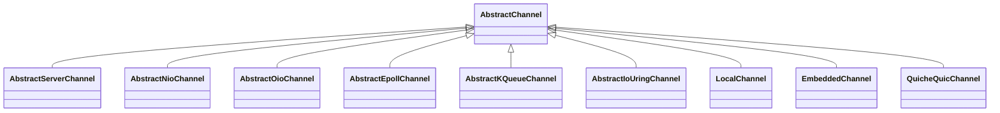

# `AbstractChannel` 子类层次分析与底层 IO 系统调用 / 零拷贝总览

## 一、`AbstractChannel` 的整体定位

[AbstractChannel.java](/netty/transport/src/main/java/io/netty/channel/AbstractChannel.java) 是所有 `Channel` 实现的骨架基类，它本身**不绑定任何 IO 模型**，只完成：

- `id`、`pipeline`、`eventLoop`、`localAddress`/`remoteAddress` 的通用管理
- `register / bind / disconnect / close / deregister / write / flush` 等通用流程（在内部类 `AbstractUnsafe` 中实现）
- 把真正会接触系统调用的动作（`doBind / doDisconnect / doClose / doBeginRead / doWrite` 等）声明为 `abstract`，留给具体 transport 实现

所以"是否使用零拷贝"完全取决于子类对应的 transport 模块。

---

## 二、子类层次结构



主要分布的源码文件：

| 子类 | 路径 |
|---|---|
| [AbstractNioChannel.java](/netty/transport/src/main/java/io/netty/channel/nio/AbstractNioChannel.java) | `transport/.../channel/nio` |
| [AbstractOioChannel.java](/netty/transport/src/main/java/io/netty/channel/oio/AbstractOioChannel.java) | `transport/.../channel/oio` |
| [AbstractServerChannel.java](/netty/transport/src/main/java/io/netty/channel/AbstractServerChannel.java) | `transport/.../channel` |
| [LocalChannel.java](/netty/transport/src/main/java/io/netty/channel/local/LocalChannel.java) | `transport/.../channel/local` |
| [EmbeddedChannel.java](/netty/transport/src/main/java/io/netty/channel/embedded/EmbeddedChannel.java) | `transport/.../channel/embedded` |
| [AbstractEpollChannel.java](/netty/transport-classes-epoll/src/main/java/io/netty/channel/epoll/AbstractEpollChannel.java) | `transport-classes-epoll` |
| [AbstractKQueueChannel.java](/netty/transport-classes-kqueue/src/main/java/io/netty/channel/kqueue/AbstractKQueueChannel.java) | `transport-classes-kqueue` |
| [AbstractIoUringChannel.java](/netty/transport-classes-io_uring/src/main/java/io/netty/channel/uring/AbstractIoUringChannel.java) | `transport-classes-io_uring` |
| [QuicheQuicChannel.java](/netty/codec-classes-quic/src/main/java/io/netty/handler/codec/quic/QuicheQuicChannel.java) | `codec-classes-quic` |

---

## 三、各子类对应的底层 IO 系统调用 & 零拷贝能力

### 1. NIO transport（`AbstractNioChannel` 系）—— JDK NIO Selector

依赖 JDK 的 `java.nio.channels.SocketChannel` / `Selector`，最终走的是 `epoll`(Linux) / `kqueue`(BSD/macOS) / `IOCP`(Windows)，但都被 JDK 包装。

[NioSocketChannel.java](/netty/transport/src/main/java/io/netty/channel/socket/nio/NioSocketChannel.java) 中的关键实现：

- 读：`byteBuf.writeBytes(javaChannel(), ...)` → 底层 `read(2)` / `recv(2)`
- 写普通数据：`SocketChannel.write(ByteBuffer[] ...)` → 底层 `write(2)` / `writev(2)`
- 写 `FileRegion`：
  ```java
  protected long doWriteFileRegion(FileRegion region) throws Exception {
      ...
      return region.transferTo(javaChannel(), position);
  }
  ```
  `region.transferTo(...)` 最终调用 `FileChannel.transferTo(...)`，在 Linux 上由 JDK 映射为 **`sendfile(2)`** 系统调用——这就是 **零拷贝（zero-copy）**：数据在内核态直接从 page cache 经 socket 发送，不经过用户态拷贝。
- 注册：`SelectableChannel.register(selector, ops)` → `epoll_ctl` / `kevent`

`NioServerSocketChannel` 的接收：`ServerSocketChannel.accept()` → `accept(2)`。

### 2. Epoll transport（`AbstractEpollChannel` 系）—— Linux 原生 epoll

通过 JNI 直接调用 Linux 系统调用，绕过 JDK，性能更好。文件 [AbstractEpollStreamChannel.java](/netty/transport-classes-epoll/src/main/java/io/netty/channel/epoll/AbstractEpollStreamChannel.java) 中能看到：

- 注册/事件：`epoll_create1`、`epoll_ctl`、`epoll_wait`
- 读：`read(2)` / `recvmmsg(2)`（datagram 批量读）
- 写：`writev(2)`（聚集写）—— `socket.writevAddresses(array.memoryAddress(0), cnt)`
- 写 `FileRegion`：`writeFileRegion()` → `region.transferTo(byteChannel, ...)` → 底层 **`sendfile(2)`**（零拷贝）
- **`splice(2)` 零拷贝管道**：这是 epoll transport 特有的"socket → socket"零拷贝能力
    - `spliceTo(AbstractEpollStreamChannel ch, int len, ...)`：把数据从一个 socket 直接 splice 到另一个 socket（中间通过 pipe，但完全在内核态完成）
    - `Native.splice(socket.intValue(), -1, pipeOut.intValue(), -1, length)`
- 接收端：`SO_REUSEPORT`、`TCP_FASTOPEN`、`TCP_CORK` 等 Linux 特有选项

> 这是 Netty 的"重火力"零拷贝路径：除 `sendfile` 外还原生支持 `splice`。

### 3. KQueue transport（`AbstractKQueueChannel` 系）—— macOS / BSD

通过 JNI 直接调用 BSD 的 `kqueue/kevent`。文件 [AbstractKQueueStreamChannel.java](/netty/transport-classes-kqueue/src/main/java/io/netty/channel/kqueue/AbstractKQueueStreamChannel.java)：

- 事件：`kqueue(2)`、`kevent(2)`
- 读/写：`read(2)`、`writev(2)`（同样有 `socket.writevAddresses(...)`）
- 写 `FileRegion`：`writeFileRegion()` → `transferTo(...)`，底层是 BSD/macOS 的 **`sendfile(2)`**（接口签名与 Linux 不同）。在 [BsdSocket.java](/netty/transport-classes-kqueue/src/main/java/io/netty/channel/kqueue/BsdSocket.java) 中可见 `ioResult("sendfile", (int) res)`。
- 不支持 `splice`（BSD 内核没有该系统调用）。

### 4. io_uring transport（`AbstractIoUringChannel` 系）—— Linux 5.x+

完全异步 SQE/CQE 提交模型。关键文件 [IoUringIoOps.java](/netty/transport-classes-io_uring/src/main/java/io/netty/channel/uring/IoUringIoOps.java) 列出了支持的所有 opcode：

| Netty 方法 | io_uring opcode | 含义 |
|---|---|---|
| `newRead` | `IORING_OP_READ` | 读字节 |
| `newWrite` | `IORING_OP_WRITE` | 写字节 |
| `newWritev` | `IORING_OP_WRITEV` | 聚集写 |
| `newSend` / `newRecv` | `IORING_OP_SEND` / `IORING_OP_RECV` | TCP 收发 |
| `newSendmsg` / `newRecvmsg` | `IORING_OP_SENDMSG` / `IORING_OP_RECVMSG` | UDP / 域套接字 |
| `newSendZc` / `newSendmsgZc` | `IORING_OP_SEND_ZC` / `IORING_OP_SENDMSG_ZC` | **零拷贝发送** |
| `newSplice` | `IORING_OP_SPLICE` | **splice 零拷贝** |
| `newConnect` / `newAccept` / `newClose` / `newPollAdd` / `newAsyncCancel` | 对应 io_uring 操作 | 连接管理 |

零拷贝亮点：

- **`SEND_ZC` / `SENDMSG_ZC`**：内核直接 DMA 用户内存，避免一次内核拷贝。在 [IoUringSocketChannel.java](/netty/transport-classes-io_uring/src/main/java/io/netty/channel/uring/IoUringSocketChannel.java) 中：
  ```java
  IoUringIoOps ops = IoUringIoOps.newSendZc(fd().intValue(), address, length, 0, nextOpsId(), 0);
  ```
- **`splice` 发送 `FileRegion`**：[IoUringFileRegion.java](/netty/transport-classes-io_uring/src/main/java/io/netty/channel/uring/IoUringFileRegion.java) 通过两段 splice 实现 file → pipe → socket 全程零拷贝：
  ```java
  IoUringIoOps spliceToPipe()    // file_fd → pipe_write
  IoUringIoOps spliceToSocket()  // pipe_read → socket_fd
  ```

### 5. OIO transport（`AbstractOioChannel` 系）—— 已废弃的 BIO

走传统阻塞 IO，[OioByteStreamChannel.java](/netty/transport/src/main/java/io/netty/channel/oio/OioByteStreamChannel.java)：

- 用 `java.io.InputStream` / `java.io.OutputStream`
- 底层是 `java.net.Socket` 的同步 `read/write`
- **不支持零拷贝**（需要在用户态拷贝到 byte[] 再写出去）

### 6. Local / Embedded / FailedChannel —— 内存型

这三类完全不接触操作系统，更谈不上零拷贝：

- [LocalChannel.java](/netty/transport/src/main/java/io/netty/channel/local/LocalChannel.java)：JVM 内基于 `Queue` 的进程内通信
- [EmbeddedChannel.java](/netty/transport/src/main/java/io/netty/channel/embedded/EmbeddedChannel.java)：单元测试用的内存 Channel
- [FailedChannel.java](/netty/transport/src/main/java/io/netty/bootstrap/FailedChannel.java)：占位的失败 Channel，所有操作都返回失败

### 7. QUIC（`QuicheQuicChannel`）

通过 [Quiche](https://github.com/cloudflare/quiche) 库实现的 QUIC 协议，运行在 UDP 之上。底层 UDP 由 `DatagramChannel`（NIO/epoll/kqueue/io_uring）承载——它本身不直接发起 syscall，零拷贝能力随承载它的 datagram channel 而定。

---

## 四、零拷贝路径汇总表

| 子类家族 | OS | 普通读 | 普通写 | `FileRegion` 零拷贝 | socket-to-socket 零拷贝 | 用户内存零拷贝发送 |
|---|---|---|---|---|---|---|
| **NIO** (`AbstractNioChannel`) | 跨平台（JDK） | `read` | `write`/`writev` | ✅ JDK `transferTo` → `sendfile` | ❌ | ❌ |
| **Epoll** (`AbstractEpollChannel`) | Linux | `read`/`recvmmsg` | `writev` | ✅ `sendfile(2)` | ✅ `splice(2)`（`spliceTo`） | ❌ |
| **KQueue** (`AbstractKQueueChannel`) | macOS/BSD | `read` | `writev` | ✅ BSD `sendfile(2)` | ❌ | ❌ |
| **io_uring** (`AbstractIoUringChannel`) | Linux 5.x+ | `IORING_OP_READ/RECV/RECVMSG` | `IORING_OP_WRITE/SEND/WRITEV/SENDMSG` | ✅ 双段 `IORING_OP_SPLICE` | ✅ `IORING_OP_SPLICE` | ✅ `IORING_OP_SEND_ZC` / `SENDMSG_ZC` |
| **OIO** (`AbstractOioChannel`) | 跨平台（BIO） | `Socket InputStream` | `Socket OutputStream` | ❌ | ❌ | ❌ |
| **Local / Embedded / Failed** | JVM 内 | — | — | ❌ | ❌ | ❌ |
| **Quic** (`QuicheQuicChannel`) | 取决于 datagram 承载 | 经 UDP | 经 UDP | — | — | — |

---

## 五、核心结论

1. `AbstractChannel` 自身不涉及任何系统调用，只做模板方法分发。具体的 `doRead* / doWrite* / doBind / doClose` 由子类对接 OS。
2. **真正发挥"零拷贝"优势的是三条路径**：
    - **`sendfile(2)`**（NIO / Epoll / KQueue）通过 [`DefaultFileRegion#transferTo`](/netty/transport/src/main/java/io/netty/channel/DefaultFileRegion.java) → `FileChannel.transferTo` 触发；
    - **`splice(2)`**（Epoll 的 `spliceTo`、io_uring 的 `IoUringFileRegion`）实现 socket↔socket、file↔socket 全程内核态搬运；
    - **`IORING_OP_SEND_ZC / SENDMSG_ZC`**（io_uring）实现用户态缓冲区零拷贝发送。
3. `FileRegion` 接口（[FileRegion.java](/netty/transport/src/main/java/io/netty/channel/FileRegion.java)）是 Netty 抽象出来的零拷贝入口，支持的 transport 在 `doWriteFileRegion` 里走快速路径，不支持的（OIO / Local / Embedded）则不应使用它（或会走降级实现）。