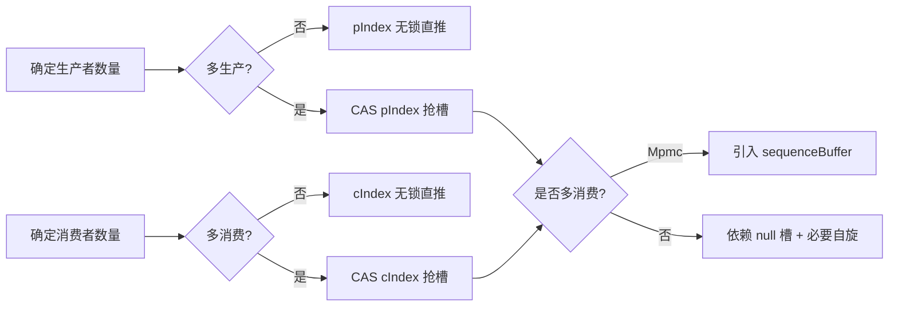
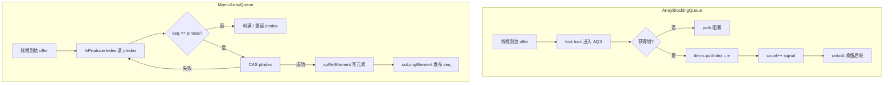

[任务规划完成]
# JCTools 四种 ArrayQueue 的 offer/poll 实现差异详解

下面针对 `SpscArrayQueue`、`MpscArrayQueue`、`SpmcArrayQueue`、`MpmcArrayQueue` 这四种基于环形数组的无锁队列，从 `offer`（生产）和 `poll`（消费）的角度做深度对比。

---

## 一、命名约定与底层共性

| 缩写 | 含义 |
|------|------|
| **S/M** (前缀第1个字母) | Single / Multi **Producer** |
| **S/M** (前缀第2个字母) | Single / Multi **Consumer** |

通用底层操作（来自 `UnsafeRefArrayAccess` / `UnsafeLongArrayAccess`）：

- `lv*` = **Load Volatile**（读 volatile 语义，acquire）
- `lp*` = **Load Plain**（普通读，无内存屏障）
- `so*` = **Store Ordered**（lazySet，release 语义）
- `sp*` = **Store Plain**（普通写）
- `cas*` = CAS 操作

四者都使用 **环形数组 + 生产者索引 (`pIndex`) + 消费者索引 (`cIndex`)**，通过 `mask = capacity - 1` 实现取模。性能优化的核心在于：**根据生产者/消费者数量减少不必要的内存屏障与 CAS**。

---

## 二、offer 接口对比

### 1. `SpscArrayQueue.offer`（单生产单消费）—— 最快

```java
public boolean offer(E e) {
    long producerIndex = this.lpProducerIndex();   // plain load: 唯一生产者，无需 volatile
    if (producerIndex >= this.producerLimit && !offerSlowPath(...)) {
        return false;
    }
    long offset = calcCircularRefElementOffset(producerIndex, mask);
    soRefElement(buffer, offset, e);               // 写元素 (lazySet)
    soProducerIndex(producerIndex + 1L);           // 推进索引 (lazySet)
    return true;
}
```

**关键点**：
- **无 CAS**：单生产者天然独占 `pIndex`，直接 `lp` 读、`so` 写。
- **`producerLimit` + `lookAheadStep` 优化**：批量探测前方 `lookAheadStep` 个槽位是否为空，命中后续多次 offer 不再读 `cIndex`，**避免和消费者写的 `cIndex` 产生伪共享/缓存争用**。
- **判满方式**：通过读取数组槽位是否为 null 来判断，而不是直接比较索引差。

### 2. `MpscArrayQueue.offer`（多生产单消费）

```java
public boolean offer(E e) {
    long producerLimit = lvProducerLimit();
    long pIndex;
    do {
        pIndex = lvProducerIndex();                // volatile load: 多生产者必须可见
        if (pIndex >= producerLimit) {
            long cIndex = lvConsumerIndex();
            producerLimit = cIndex + mask + 1L;
            if (pIndex >= producerLimit) return false;
            soProducerLimit(producerLimit);        // 缓存 producerLimit 减少读 cIndex
        }
    } while (!casProducerIndex(pIndex, pIndex + 1L));   // CAS 抢占槽位

    long offset = calcCircularRefElementOffset(pIndex, mask);
    soRefElement(buffer, offset, e);               // CAS 成功后再写元素
    return true;
}
```

**关键点**：
- **CAS `pIndex` 抢占槽位**：多生产者必须竞争 `pIndex`。
- **先抢索引、后写元素**：抢到 `pIndex` 后异步写 entry，消费者 `poll` 时如果发现 `pIndex` 已推进但 entry 仍为 null，会**自旋等待**（见后面 poll）。
- **`producerLimit` 缓存**：避免每次 offer 都读 `cIndex`（消费者写的）。
- 还有 `offerIfBelowThreshold` / `failFastOffer` 等变体。

### 3. `SpmcArrayQueue.offer`（单生产多消费）

```java
public boolean offer(E e) {
    long currProducerIndex = lvProducerIndex();    // volatile: 多消费者要看见
    long offset = calcCircularRefElementOffset(currProducerIndex, mask);
    if (null != lvRefElement(buffer, offset)) {    // 槽位非空：可能满
        long size = currProducerIndex - lvConsumerIndex();
        if (size > mask) return false;             // 真的满了
        // 否则自旋等消费者清空槽位
        while (null != lvRefElement(buffer, offset)) {
            
        }
    }
    soRefElement(buffer, offset, e);
    soProducerIndex(currProducerIndex + 1L);
    return true;
}
```

**关键点**：
- **生产端无 CAS**：单生产者独占 `pIndex`，但因为多消费者会读 `pIndex`，所以用 `lv` 读。
- **判满靠槽位 null 检测 + 索引差校验**：消费者是先 CAS `cIndex` 再清槽，存在槽位还没清空但索引已推进的瞬间，所以需要自旋。

### 4. `MpmcArrayQueue.offer`（多生产多消费）—— 最重

```java
public boolean offer(E e) {
    long[] sBuffer = sequenceBuffer;               // 额外的 sequence 数组
    do {
        pIndex = lvProducerIndex();
        seqOffset = calcCircularLongElementOffset(pIndex, mask);
        seq = lvLongElement(sBuffer, seqOffset);
        if (seq < pIndex) {                        // 槽位还未被消费者释放
            if (pIndex - capacity >= cIndex && pIndex - capacity >= (cIndex = lvConsumerIndex()))
                return false;                      // 队列满
            seq = pIndex + 1L;                     // 让外层循环继续
        }
    } while (seq > pIndex || !casProducerIndex(pIndex, pIndex + 1L));

    spRefElement(buffer, calcCircularRefElementOffset(pIndex, mask), e);  // plain 写元素
    soLongElement(sBuffer, seqOffset, pIndex + 1L);                        // release 发布 seq
    return true;
}
```

**关键点（Vyukov 风格 MPMC 算法）**：
- **额外维护 `sequenceBuffer[]`**：每个槽位一个 long 序列号，用作"槽位状态机"。
- **生产者期望** `seq == pIndex`（空槽），写完后 `seq = pIndex + 1`（已填充）；
- **消费者期望** `seq == cIndex + 1`（已填充），消费后 `seq = cIndex + capacity`（再次空闲）。
- **元素写用 `sp`（plain）**：因为靠 `seq` 的 release 写来发布可见性，省一个屏障。
- 同时存在 **CAS `pIndex` + `seq` 协议**，因此最重，但能严格保证 MPMC 正确性且不会出现"索引推进但元素未写"的可见窗口。

---

## 三、poll 接口对比

### 1. `SpscArrayQueue.poll`

```java
public E poll() {
    long consumerIndex = lpConsumerIndex();        // plain: 唯一消费者
    long offset = calcCircularRefElementOffset(consumerIndex, mask);
    E e = lvRefElement(buffer, offset);            // volatile 读元素
    if (null == e) return null;                    // 空：直接返回
    soRefElement(buffer, offset, null);            // 清槽
    soConsumerIndex(consumerIndex + 1L);
    return e;
}
```

**关键点**：判空只靠槽位是否为 null，**不需要再读 `pIndex`**（SPSC 中元素写在索引推进之前可见即可）。

### 2. `MpscArrayQueue.poll`

```java
public E poll() {
    long cIndex = lpConsumerIndex();               // 唯一消费者，plain 读
    long offset = calcCircularRefElementOffset(cIndex, mask);
    E e = lvRefElement(buffer, offset);
    if (null == e) {
        if (cIndex == lvProducerIndex()) return null;  // 真空
        // 生产者已 CAS 推进 pIndex 但还没写元素，自旋等
        do { e = lvRefElement(buffer, offset); } while (e == null);
    }
    spRefElement(buffer, offset, null);            // plain 清槽（无并发消费者）
    soConsumerIndex(cIndex + 1L);
    return e;
}
```

**关键点**：
- **可能短暂自旋**：补偿 MpscArrayQueue.offer 中"先 CAS 索引，后写元素"造成的可见窗口。
- **消费端无 CAS、清槽用 `sp`**：因为只有一个消费者。
- 还有非阻塞变体 `relaxedPoll`：发现 null 直接返回，不区分"真空"还是"过渡中"。

### 3. `SpmcArrayQueue.poll`

```java
public E poll() {
    long currProducerIndexCache = lvProducerIndexCache();
    long currentConsumerIndex;
    do {
        currentConsumerIndex = lvConsumerIndex();
        if (currentConsumerIndex >= currProducerIndexCache) {
            long currProducerIndex = lvProducerIndex();
            if (currentConsumerIndex >= currProducerIndex) return null;
            currProducerIndexCache = currProducerIndex;
            svProducerIndexCache(currProducerIndex);   // 缓存 pIndex 减少读
        }
    } while (!casConsumerIndex(currentConsumerIndex, currentConsumerIndex + 1L));
    return removeElement(buffer, currentConsumerIndex, mask);  // soRefElement(null)
}
```

**关键点**：
- **CAS `cIndex` 抢占消费槽**：多消费者竞争。
- **`producerIndexCache` 缓存生产者索引**：减少对 `pIndex` 的高频 volatile 读。
- 与 `MpscArrayQueue` 互为镜像。

### 4. `MpmcArrayQueue.poll`

```java
public E poll() {
    do {
        cIndex = lvConsumerIndex();
        seqOffset = calcCircularLongElementOffset(cIndex, mask);
        seq = lvLongElement(sBuffer, seqOffset);
        expectedSeq = cIndex + 1L;
        if (seq < expectedSeq) {                   // 槽位还没被生产者填充
            if (cIndex >= pIndex && cIndex == (pIndex = lvProducerIndex()))
                return null;                       // 真的空
            seq = expectedSeq + 1L;
        }
    } while (seq > expectedSeq || !casConsumerIndex(cIndex, cIndex + 1L));

    long offset = calcCircularRefElementOffset(cIndex, mask);
    E e = lpRefElement(buffer, offset);            // plain 读元素（seq 已 acquire）
    spRefElement(buffer, offset, null);
    soLongElement(sBuffer, seqOffset, cIndex + mask + 1L);  // 把 seq 设为下一轮空闲值
    return e;
}
```

**关键点**：
- 通过 `seq` 状态机感知"该槽位已被生产者发布"，**避免了 Mpsc poll 那种自旋等元素的写入**。
- **同时存在 CAS `cIndex` 与 `seq` 协议**，是最复杂但通用性最强的实现。

---

## 四、对比总结表

| 维度 | Spsc | Mpsc | Spmc | Mpmc                  |
|------|------|------|------|-----------------------|
| **offer 是否 CAS** | ❌ | ✅ CAS pIndex | ❌ | ✅ CAS pIndex + `so` seq |
| **poll 是否 CAS** | ❌ | ❌ | ✅ CAS cIndex | ✅ CAS cIndex + `so` seq |
| **pIndex 读** | `lp` | `lv` | `lv` | `lv`                  |
| **cIndex 读** | `lp` | `lp` | `lv` | `lv`                  |
| **判满策略** | 槽位 null + lookAhead | `pIndex` vs `producerLimit` 缓存 | 槽位 null + 索引差 + 自旋 | `seq < pIndex` 槽位状态机  |
| **判空策略** | 槽位 null | 槽位 null + 必要时读 pIndex 自旋 | `cIndex >= pIndex`（带 cache） | `seq < cIndex+1` 槽位状态机 |
| **额外内存** | producerLimit | producerLimit | producerIndexCache | sequenceBuffer[]      |
| **吞吐 / 性能** | 极高 | 高（生产端竞争） | 高（消费端竞争） | 较低（双端竞争 + seq）        |
| **典型场景** | Disruptor 风格、netty EventLoop 任务队列 | 多线程入队、单 worker（Netty 默认 task queue） | 单生产、多 worker 取任务 | 完全无约束的并发队列            |

---

## 五、设计要点速记



**核心设计哲学**：
1. **能不用 volatile / CAS 就不用**——单端访问者用 plain load/store，将屏障开销降到最低。
2. **缓存对端索引**（`producerLimit` / `producerIndexCache`），避免反复读对方写的"热缓存行"，**降低伪共享/缓存抖动**。
3. **CAS 的对象只是索引、不是元素**——元素的发布通过 `lazySet`（`so*`） + `seq` 状态机来实现 happens-before。
4. **MPMC 用额外 sequence 数组换并发正确性**，是泛用但代价最高的方案；其余 3 种是针对特定场景下的优化裁剪。

如果你的业务里能确定生产/消费的数量，**优先选用最特化的实现**（如 Netty 默认就是 `MpscArrayQueue`，因为多个外部线程提交任务给单个 EventLoop 消费）。


[任务规划完成]
# `MpmcArrayQueue` vs JUC `BlockingQueue` 的 offer/poll 实现差异详解

JUC 中常见的 `BlockingQueue` 实现包括 `ArrayBlockingQueue`、`LinkedBlockingQueue`、`LinkedTransferQueue` 等。下面以最具可比性的 **`ArrayBlockingQueue`**（同样是有界、基于环形数组）作为主要对比对象，并补充 `LinkedBlockingQueue` / `LinkedTransferQueue` 的关键差异。

---

## 一、整体设计哲学对比

| 维度 | `MpmcArrayQueue` (JCTools) | `ArrayBlockingQueue` (JUC) |
|------|----------------------------|----------------------------|
| **同步原语** | 无锁（CAS + lazySet + sequence 数组） | `ReentrantLock` + 两个 `Condition` |
| **阻塞能力** | 不阻塞，满则返回 false | 支持阻塞（`put`/`take`） |
| **数据可见性机制** | volatile 索引 + sequence 状态机 | 锁的 happens-before 保证 |
| **缓存行优化** | L1/L2/L3 Pad（多层填充消除伪共享） | 无任何字段填充 |
| **API 契约** | `MessagePassingQueue`（弱契约，允许 relaxed 语义） | `BlockingQueue`（强契约） |
| **核心目标** | 极致吞吐 / 低延迟 | 通用、阻塞协调 |

---

## 四、其他 BlockingQueue 实现的差异

### `LinkedBlockingQueue`：双锁分离

```java
private final ReentrantLock putLock = new ReentrantLock();
private final ReentrantLock takeLock = new ReentrantLock();
private final AtomicInteger count = new AtomicInteger();
```

- **生产者锁与消费者锁分离**——offer 与 poll 可以**并发执行**（一个生产者+一个消费者）。
- 但**多生产者之间、多消费者之间仍互斥**。
- 这点与 `MpmcArrayQueue` 思想接近（解耦双端），但仍然依赖锁，且基于链表会**频繁分配 Node 对象**，GC 压力大。

### `LinkedTransferQueue`：CAS + Dual Queue

- 真正的**无锁**实现（基于 Michael-Scott 队列变种）。
- 与 `MpmcArrayQueue` 在并发原语层面更接近：CAS 抢节点、`LockSupport.park` 阻塞匹配。
- 但是基于**链表**，每次 offer 都要 `new Node()`，**对象分配 + 缓存不友好**；MpmcArrayQueue 的环形数组在 CPU 缓存行级别更优。

### `SynchronousQueue`：无容量握手队列

- 不存数据，offer 必须有 take 配对才能成功。
- 与 `MpmcArrayQueue` 设计目标完全不同，不可直接对比。

---

## 五、关键差异总结对比表

| 对比维度 | `MpmcArrayQueue` | `ArrayBlockingQueue` | `LinkedBlockingQueue` | `LinkedTransferQueue` |
|---------|------------------|----------------------|------------------------|-----------------------|
| **底层结构** | 环形数组 + sequence 数组 | 环形数组 | 单向链表 | 单向链表(Dual) |
| **锁/CAS** | 全 CAS 无锁 | 单 ReentrantLock | 双 ReentrantLock | 全 CAS 无锁 |
| **offer 阻塞** | 永不 | put 阻塞，offer 不阻塞 | 同左 | 同左 |
| **poll 阻塞** | 永不 | take 阻塞，poll 不阻塞 | 同左 | 同左 |
| **生产 vs 消费并发** | ✅ 完全并行 | ❌ 串行（同把锁） | ✅ 双锁并行 | ✅ 完全并行 |
| **多生产者并发** | ✅ CAS pIndex | ❌ 互斥 | ❌ putLock 互斥 | ✅ CAS |
| **多消费者并发** | ✅ CAS cIndex | ❌ 互斥 | ❌ takeLock 互斥 | ✅ CAS |
| **唤醒机制** | 无（自旋/退避） | Condition.signal | Condition.signal | LockSupport.unpark |
| **GC 压力** | 0（数组复用） | 0（数组复用） | 高（每次 new Node） | 高 |
| **缓存行对齐** | L1/L2/L3 多层 padding | 无 | 无 | 无 |
| **可见性原语** | volatile + sequence release | 锁 | 锁 | volatile + CAS |
| **典型耗时（无竞争）** | ~10ns 级 | ~50–100ns 级 | ~50–100ns 级 | ~30–50ns 级 |
| **典型耗时（高竞争）** | 仍然纳秒级（CAS 重试） | 微秒级（park/unpark） | 微秒级 | 纳秒-微秒级 |

---

## 六、为何 `MpmcArrayQueue` 比 `ArrayBlockingQueue` 快得多



**性能优势来源**：
1. **无锁**：不会因 `park/unpark` 进入内核态，竞争失败只是 CAS 重试，纳秒级。
2. **生产端与消费端独立索引 + 独立 sequence**：生产、消费可以**真正并行**，而 ABQ 只能串行。
3. **缓存行 padding**：`pIndex`、`cIndex`、`buffer` 引用分别独占 cache line，避免**伪共享**导致的 cache miss 抖动。
4. **零对象分配**：环形数组复用槽位，无 GC 压力，对低延迟场景至关重要（如金融交易、Disruptor 风格管线）。
5. **更弱的内存语义**：用 `sp`/`lp` 替代 `volatile` 读写，将屏障限制在最少的关键点（仅在 sequence 上）。

---

## 七、何时选择哪种？

| 场景 | 推荐 |
|------|------|
| 高吞吐、低延迟、可接受非阻塞 API | `MpmcArrayQueue` |
| 需要标准 `BlockingQueue` 语义（阻塞、超时、可中断） | `ArrayBlockingQueue` / `LinkedBlockingQueue` |
| 单生产多消费 / 多生产单消费的明确场景 | 用 JCTools 的 `Mpsc`/`Spmc` 进一步特化 |
| 需要传递（必须配对）语义 | `SynchronousQueue` / `LinkedTransferQueue` |
| 容量未知、不希望预分配大数组 | `LinkedBlockingQueue` |
| 极致性能、明确 SPSC | `SpscArrayQueue` 或 Disruptor RingBuffer |

---

## 八、一句话总结

> **`ArrayBlockingQueue` 用一把大锁换来正确性与阻塞能力；`MpmcArrayQueue` 用 sequence 状态机 + CAS + 缓存行填充把"正确性 + 高吞吐 + 低延迟"同时拿下，但代价是放弃了内置阻塞语义，需要调用方自行处理"队列空/满时怎么办"。**